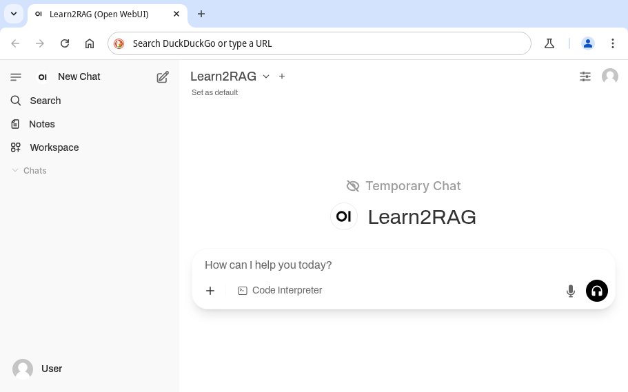

# User documentation

The main Learn2RAG interface provides an input field in the middle of the window.
Type your question in the field and then either press <kbd>Enter</kbd> or a graphical button.
A chat would be opened where Learn2RAG would provide an answer after some processing time.
